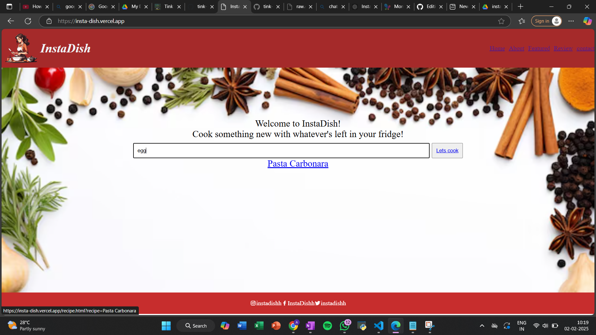

# InstaDish 🎯

## Basic Details
### Team Name: Spark Ignitors

### Team Members
- Bhavya Raj K - [College of engineering Adoor]

### Hosted Project Link
[InstaDish Web App](https://insta-dish.vercel.app/)

### Project Description
InstaDish is a web app that allows users to input the ingredients they have at home, and it will suggest recipes that can be made using those ingredients. This app helps users find creative meal ideas, reduce food waste, and save time in the kitchen by making the most of what they already have.

### The Problem Statement
Many people often find themselves with a fridge full of ingredients but no idea what to cook. This leads to food wastage, and a tendency to order or buy pre-made meals, which can be costly and unhealthy. There is a need for a solution that helps users make the most of the ingredients they already have in their kitchens by suggesting suitable recipes.

### The Solution
InstaDish provides a simple and effective solution to the problem of meal planning with limited ingredients. By allowing users to input the ingredients they have at home, the app generates personalized recipe suggestions. The app offers a convenient, user-friendly platform that helps users create meals with what they already have on hand.

## Technical Details

### For Software:
- HTML, JavaScript, CSS
- VS Code, Git

### For Hardware:
- None

## Implementation

### For Software:
#### # Installation
There is no installation required for InstaDish, as it is a web-based application.

#### # Run
To run the app locally, you can use the **Live Server** extension in Visual Studio Code to view the project.

### Project Documentation

#### Screenshots

*This screenshot shows the user input screen where ingredients can be entered.*

![Screenshot2]   https://drive.google.com/drive/folders/1VHbTV0HlJ0PNSW95SFQD1dGH9NbznQ39
*This screenshot shows the recipe suggestions generated based on entered ingredients.*

  
*This screenshot shows a detailed recipe view with instructions and ingredients.*

#### Diagrams
  
*This diagram illustrates the workflow of the InstaDish app.*

### For Hardware:

#### Schematic & Circuit
  
*Add caption explaining connections*

  
*Add caption explaining the schematic*

#### Build Photos
  
*Team photo*

  
*List out all components shown*

  
*Explain the build steps*

  
*Explain the final build*

### Project Demo
#### Video
[Add your demo video link here]  
*This video demonstrates how users can input ingredients into InstaDish and receive personalized recipe suggestions.*

#### Additional Demos
[Add any extra demo materials/links]

## Team Contributions
- Bhavya Raj K: Designed the app interface, developed the recipe suggestion algorithm, and integrated the frontend.
- Worked on project documentation and user experience design.

---
Made with ❤️ at TinkerHub

---
